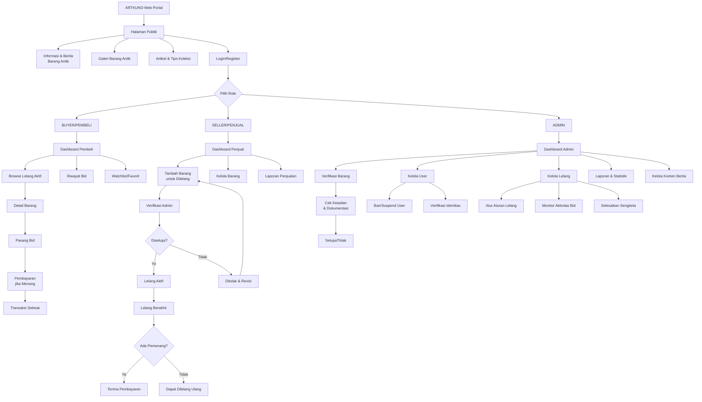

# ARTKUNO Web Portal - Diagram Alur Sistem



## 📋 Penjelasan Alur Sistem

### 🌐 **Halaman Publik**
- Informasi & Berita seputar barang antik
- Galeri barang antik untuk eksplorasi
- Artikel & tips koleksi
- Login/Register untuk akses lebih lanjut

### 👤 **Role User & Dashboard**

#### **1. BUYER (PEMBELI)** 
- **Dashboard**: Melihat ringkasan aktivitas
- **Browse**: Menelusuri lelang barang antik yang aktif
- **Riwayat Bid**: Melihat riwayat penawaran yang pernah dilakukan
- **Watchlist**: Menyimpan barang favorit untuk dipantau
- **Detail Barang**: Melihat informasi lengkap barang (foto, deskripsi, harga awal, dll)
- **Pasang Bid**: Melakukan penawaran/bid pada barang
- **Pembayaran**: Melakukan transaksi pembayaran jika memenangkan lelang
- **Transaksi Selesai**: Konfirmasi pembelian barang

#### **2. SELLER (PENJUAL)**
- **Dashboard**: Ringkasan penjualan dan produk
- **Tambah Barang**: Mengunggah barang baru untuk dilelang
- **Kelola Barang**: Mengelola barang yang sedang/telah dilelang
- **Laporan Penjualan**: Melihat statistik dan laporan penjualan

**Alur Verifikasi:**
1. Penjual submit barang → Verifikasi Admin
2. Admin cek keaslian & dokumentasi
3. Jika disetujui → Lelang Aktif
4. Jika ditolak → Penjual bisa revisi & submit ulang

**Alur Lelang:**
1. Lelang Aktif berjalan
2. Lelang Berakhir → Ada pemenang?
3. Jika Ya → Penjual terima pembayaran
4. Jika Tidak → Barang bisa dilelang ulang

#### **3. ADMIN**
- **Dashboard**: Kontrol panel utama admin
- **Verifikasi Barang**: Memeriksa keaslian & dokumentasi barang baru
- **Kelola User**: Mengelola user (ban, suspend, verifikasi identitas)
- **Kelola Lelang**: Mengatur aturan lelang, monitor bid, selesaikan sengketa
- **Laporan & Statistik**: Melihat data dan analisis platform
- **Kelola Konten Berita**: Mengelola artikel dan berita

## 🔄 **Alur Interaksi Utama**

### Buyer Placement:
```
Login → Pilih Role (Buyer) → Dashboard Pembeli
→ Browse/Watchlist → Detail Barang → Bid
→ Menang? → Pembayaran → Selesai
```

### Seller Placement:
```
Login → Pilih Role (Seller) → Dashboard Penjual
→ Tambah Barang → Verifikasi Admin → Disetujui?
→ Jika Ya: Lelang Aktif → Lelang Selesai → Terima Pembayaran
→ Jika Tidak: Revisi & Submit Ulang
```

### Admin Management:
```
Login → Pilih Role (Admin) → Dashboard Admin
→ Verifikasi/Kelola User/Kelola Lelang/Laporan/Konten
```

## 📊 **Fitur Inti yang Perlu Dikembangkan**

- [ ] Sistem autentikasi dengan 3 role (Buyer, Seller, Admin)
- [ ] Halaman publik dengan info, galeri, artikel
- [ ] Sistem lelang/bidding
- [ ] Verifikasi barang oleh admin
- [ ] Sistem pembayaran
- [ ] Dashboard untuk setiap role
- [ ] Sistem notifikasi untuk setiap role
- [ ] Laporan dan statistik
- [ ] Manajemen user (ban, suspend, verifikasi)
- [ ] Kelola konten berita/artikel
